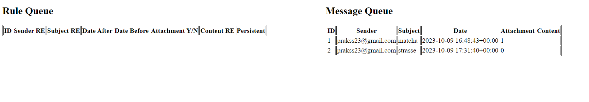

# SS23 TUM Advanced Practical Course - Message Correlation and Inter-Instance/Process Communication in Process Aware Information Systems 

## Abstract
Coordination and communication in automated process-oriented systems are essential for their performance and efficiency in task execution. To be effective in its operations, a system must be capable of asynchronous reactions and interactions with various external systems and communication media. One widely adopted communication medium is electronic mail (e-mail), facilitating asynchronous information exchange. In the context of this TUM lab course, we have developed a custom e-mail message correlator synchronizing asynchronous communication between a cocktail robot, its users, and potential external systems. This report provides an overview of its implementation and functionality.

## Motivation
Message correlators play a crucial role in process aware information systems (PAIS), synchronizing inter- and intra-process communication and supporting process instance choreography scenarios. Their purpose is to address the challenges of coordinating asynchronous messages, ensuring they reach the right destination at the right time given the right conditions. With a message correlator, it is possible to align incoming and outgoing messages based on a set of predefined rules, offering a structured approach that contributes to security, maintainability, efficiency, and reliability of asynchronicity in PAIS.

## Message Correlator Structure
Message correlators can differ in their implementation, but each correlator has to define its behavior regarding two different communication items: messages and requests. We list the tasks it has to fulfill for handling both:

1) Message Handling: How messages are managed when they arrive at the correlator.
    1) Message Reception: A correlator has to receive messages from arbitrary sources. What constitutes as a message (source, type) is defined by the correlator. 
    2) Message Analysis: The contents of the message need to be analyzed to extract relevant information for correlation.
    3) Message Forwarding / Matching:  After attempting to match with existing requests, the message needs to be forwarded. We distinguish variations in forwarding behavior as follows:
        1) The message is forwarded to a potential instance that is waiting for the message, or
        2) The message is stored for later use, or 
        3) A new instance of a process is created, with the message as input.
4) Request Handling: How correlation requests are managed when they arrive at the correlator.
    1) Request reception: Process instances may require messages from sources they cannot directly contact. They create a correlation request to ask for the required information from the correlator. The correlator needs to be able to receive these requests.
    2) Request Analysis: The correlation request has to be analyzed by its provided correlation rules to identify what information it requires the message to contain, the criteria the message needs to fulfill, and where it can be found.
    2) Request Forwarding / Matching: The correlator is responsible for finding the message that best correlates with the rule provided by the request. It must then forward the request by:
        1) Forwarding the message to the requesting instance, or 
        2) Storing the request when there is no match, or
        3) Defining different behavior for the request in case of no match or a match.

We will define how we implemented each of these functionalities in our custom e-mail correlator and describe an addition we made in its request and message handling in the following sections.

## Software Architecture
The correlator is written using mainly Python and Bottle. The frontend depicting the correlator rule and message waiting queues is served through a Bottle template and uses JavaScript to communicate with the Python Backend. We use SQLite for our database.

Figure 1: Sketch depicting the software architecture of the custom e-mail message correlator.

As depicted in the figure above, our correlator consists of the following parts: A correlation request/rule handling component (corr.py), a message-handling component (receive_email.py), a database (database.db) which is initialized by the init_db.py script, and a template generating our frontend reprssentation for the waiting queues, make_queues.tpl.

The file corr.py connects the correlator to the CPEE process engine, listening to HTTP GET requests sent to the endpoint https://lehre.bpm.in.tum.de/21047/get_matching_message for a CPEE process instance's correlation request/rule. The correlation request sent has to comply with the correlation rule model, which is further specified in the model section below.

The file receive_email.py connects the correlator to the message provider, which in this specific case is the inbox of a Google Mail account (prakss23@gmail.com), by fetching unread e-mails from its inbox every full minute with IMAP. These e-mails are then processed according to our established model for messages (see model section below).

The correlation of rules to messages occurs on the corr.py side, whereas the correlation of messages to rules occurs on the receive_email.py side.

## Message and Request Model
In this section, we define what parts of an e-mail message constitutes as content to be parsed and analyzed for our custom correlator. The end result is defined in our database schema files email_schema.sql (message) and rule_schema.sql (correlation rule/request).

Figure 2: E-mail and Rule model for our custom e-mail message correlator.

As depicted in Figure 2, an e-mail message within the context of our correlator has a sender, a subject, a date when it is received, a content field, as well as a boolean indicator of whether it has attachments or not. We also use this model for our database schema, which is why we have a unique numeric auto-incrementing field called "ID", which serves as an indicator of how long the saved e-mail has waited within the matching queue (the lower the number, the higher its priority during matches). The subject and content of any e-mail message can be potentially empty, which is why we modeled both of them to be optional.

To model a correlation rule, we defined the rule parameter specifications and their types based on the e-mail message model. It is essential for the correlator to be able to match the e-mail messages we modeled in Figure 2 with the rules, so we provide attributes tailored to the datatype of the respective field. We categorize the different attributes based on their rule category:

Regular Expression rules:
- sender
- subject
- content

ISO 8601 rules:
- before
- after

Boolean rule:
- has_attachment

The rules indicate what possible inputs can be used for the respective fields. For example, if a correlation request sends a correlation rule with the "has_attachment" field filled in with any input other than boolean, it would be rejected because it does not comply with the given model. It is always possible to create a rule with no restriction criterias, therefore we added the optional behind every field that can be sent from the process instance to our correlator as optional. 

In addition to the attributes used for matching, our model also includes the field "ID" which serves a similar function to the "ID" in the e-mail message model. It indicates a non-matched rule's position in the queue, with a lower number indicating a higher priority. Rules also have two further fields: the "callback" field containing the callback URL and the "persistent" field, which indicates whether the given rule is persistent or not.

## Functionality
We will now showcase and discuss the functionality of the two major components in our correlator: corr.py and receive_email.py. The file corr.py is responsible for handling incoming correlation requests, whereas receive_email.py is responsible for handling incoming messages.

Figure 3: CPEE process instance with highlighted points relevant for endpoint specification and invalid arguments. As depicted, we need to specify the endpoint according to the highlighted areas in the figure first. This specific image also showcases an invalid argument pair (has_attachment expects a boolean, not a string) - causing the process instance to stop upon execution, as it receives 400 as a response.

We will now follow the request handling process: When we listen to process instances from our endpoint(see highlighted configuration in Figure 3), we receive correlation requests. Its correlation rule is checked for its validity based on our correlation rule model in Figure 2 before it is accepted. 

Upon receiving a valid request, we fetch every message that is available from the database and attempt a match between the provided correlation rules and the existing messages. We can either match the rule with messages or not at all.

Figure 4: This series of images depicts a successful correlation request match initiated by corr.py. The waiting queue for messages is non-empty. We proceed to send a correlation request with the rule that the subject must contain the regular expression 'matcha' over CPEE, which matches with an e-mail. Upon matching, the process instance is depicted to continue from its previous state, and due to the output handling specification, we can see that result contains the e-mail messages' content. This e-mail message is also subsequently removed from the waiting queue and by extention, the database.

- When there is a match, we fetch the message from the database and send it to the callback URL. The message is deleted from the database and the request is dropped. (Figure 4)

- When there is no match, we save our request with its correlation rules and their callback-URL in the database. It receives an ascending numeric ID to distinguish its priority during matching, with a smaller ID indicating the rule being older, and therefore prioritized. (Figure 5)

Figure 5: A series of images depicting a no-match situation from the corr.py perspective. The first image depicts the process instance stopping after the correlation rule with subject as "abcdefg" could not find a matching message in the waiting queue, and therefore has stopped its execution while waiting for its callback. The second image depicts the rule added to the waiting queue on the frontend of our application.

However, if we receive a request containing a rule that already is present within the database, we do not save it, but instead make the older rule entry persistent by changing its persistent value to true in the database (Figure 6). This changes the message rentention on a match, which is explained in the next section. 

Figure 6: When sending an additional correlation request from another process instance with the exact same set of correlation rules that are already in the waiting queue, the existing rule is automatically set as persistent, as depicted in the second image.

We handle messages in a similar manner. Every full minute, our script fetches unread e-mails from the e-mail inbox of the address 'prakss23@gmail.com'. When there is an unread, and therefore new e-mail, we initiate the message handling process:

The content of the e-mail is extracted based on the parts we modeled in Figure 2. We then fetch all requests/rules from our database and check if the incoming message matches with any of the saved requests. It can either match or not.
When it does match, we distinguish two cases:

1) When it matches a non-persistent rule, the message is forwaded to the callback URL associated with the rule. The rule is subsequently deleted from the database and the e-mail message is dropped. (Figure 7)

2) When it matches a persistent rule (Figure 8), the message is forwarded to the callback associated with the rule, but the e-mail message is not deleted. It is saved in the database, as a persistent rule indicates that messages that match with it may be requested again.

Figure 7: This series of images shows a match made with an incoming e-mail matching to a non-persistent rule in the database. After the new incoming e-mail matches to the content regular expression 'marshmallow', the rule is subsequently removed from the rule queue, and the message is dropped. The message, as we can see in the last image, was forwarded to the CPEE process instance and passed to it as the data element named result.

Figure 8: This series of images shows a match made with an incoming e-mail matching to a persistent rule saved in the database. The message matches to the subject regular expression rule 'abcedfg', but is not dropped after its match. In the last image, we can see the messsage has been saved into the queue in spite of its match due the rule being persistent.

When the e-mail message does not find any matching rules, it is saved into the database, with an ascending ID to distinguish its priority in the queue. (Figure 9)

 Figure 9: An unmatched new message is saved into the message queue after finding no matching correlation rule in the database. 

Both waiting queues are visualized by the frontend of the correlator, accessible under the URL https://lehre.bpm.in.tum.de/ports/20147/ when running the corr.py file. It showcases the requests/rules and messages currently saved in the queues. One feature that the frontend also provides is the possibility to manually adjust a rule to become persistent and not persistent. To toggle and therefore change the rule's persistency, simply click on the row it is featured to make it persistent (1) or not persistent(0) and refresh the browser to check its current state.

## Use cases and Future Work
As of now, our custom e-mail message correlator can be used for ordering or maintenance processes, where e-mail messages could be sent to the CPEE process instances and forwarded. We can define a specific set of criteria to look out for in e-mails to distinguish orders from maintenance tasks for example, or have customers make custom recipes that are registered through specific regular expressions in the e-mail body.

However, we see that our work can still be extended by different features. Our e-mail model does not include every single attribute that can be considered. We can imagine an extension to include the file type of the attachment, as well as its contents or meta information which may be relevant for maintenance or ordering tasks. We can also imagine processes to react differently than simply forwarding the output; a case we thought would be interesting is the instantiation of other processes within the cocktail robot.
Additionally, our frontend also does not yet offer a continuous updating interface, requiring the user to refresh manually whenever they wish to see the current state of the waiting queues. Graphically, the frontend user interface could also have additional styling to make it more appealing. 

## References used for this project
- [Python E-mail library](https://docs.python.org/3.8/library/email.html)
- [Python IMAP protocol client module](https://docs.python.org/3/library/imaplib.html)
- [E-mail SEARCH criteria keywords and what parameters it expects](https://datatracker.ietf.org/doc/html/rfc3501#section-6.4.4)
- [Python E-mail Policy Objects](https://docs.python.org/3.8/library/email.policy.html)
- [Python Regular Expression module](https://docs.python.org/3.8/library/re.html)
- [CPEE - Cloud Process Execution Engine](https://cpee.org/)
- [Stack Overflow: What is the maximum length of a URL in different browsers?](https://stackoverflow.com/questions/417142/what-is-the-maximum-length-of-a-url-in-different-browsers)
- [Stack Overflow: What is the maximum of a length of a valid email address?](https://stackoverflow.com/questions/386294/what-is-the-maximum-length-of-a-valid-email-address)
- [Bottle Tutorial for a web-based todo list](https://bottlepy.org/docs/dev/tutorial_app.html#using-bottle-for-a-web-based-todo-list)
- [Blog post tutorial about how to send and receive e-mails in Python](https://humberto.io/blog/sending-and-receiving-emails-with-python/)
- [TUM Slides provided by lab course about correlators](https://lehre.bpm.in.tum.de/~mangler/Slides/Corr.pdf)
- [TUM lab course description](https://campus.tum.de/tumonline/ee/ui/ca2/app/desktop/#/slc.tm.cp/student/courses/950691568?$ctx=design=ca;lang=de&$scrollTo=toc_overview)